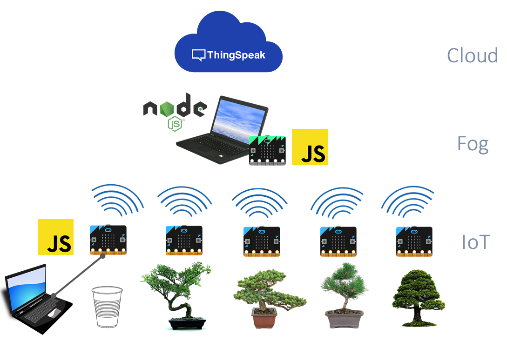

BonsaiFog is an app which can be used to run an _active learning_ lab to introduce Fog computing to CS students. It is described in 

> [Antonio Brogi](http://pages.di.unipi.it/brogi), [Stefano Forti](http://pages.di.unipi.it/forti), [Ahmad Ibrahim](http://pages.di.unipi.it/ibrahim), [Luca Rinaldi](http://lucar.in)  
> **[Bonsai in the Fog: an Active Learning Lab with Fog Computing](http://pages.di.unipi.it/forti/research/)**  
> in Proceedings of the [3rd IEEE International Conference on Fog and Mobile Edge Computing (FMEC 2018)](http://emergingtechnet.org/FMEC2018/),  
> Barcelona, Spain, 2018.

If you wish to reuse this code for other research, please cite the above mentioned article.

To design the activity, we took inspiration from the following use case:

_A bonsai greenhouse company planning to adopt a software solution to monitor and visualise soil moisture of their cultivation._

The activity is a two-hours hands-on session designed to 

* constitute a first hands-on programming lab on Fog computing, practically showing the difference between IoT+Edge, IoT+Cloud and Fog deployment models, by exploiting active learning methodologies
* have a quick learning curve, only requiring students familiarity with high-level programming languages (so that the activity could fit in a two-hours session),
* have limited cost (i.e., hundreds of euro3) with respect to enterprise solutions (i.e., thousands of euro), possibly being cross-platform with respect to different (students’ laptops) operating systems.

To achieve these goals, we created a lifelike scenario that can be incremented step-by-step to show all different deployment models (viz., IoT+Edge, IoT+Cloud and Fog). 

To set up the experimental IoT testbed capable of monitoring moisture of the plants growing in the greenhouse, we employed [micro:bits](http://microbit.org), cheap and easy-to-use embedded systems that can be programmed in JavaScript. JavaScript has also been used for implementing a gateway module.

# Testbed

Below we show the testbed we implemented for the purposes of the _active learning_ practical.

